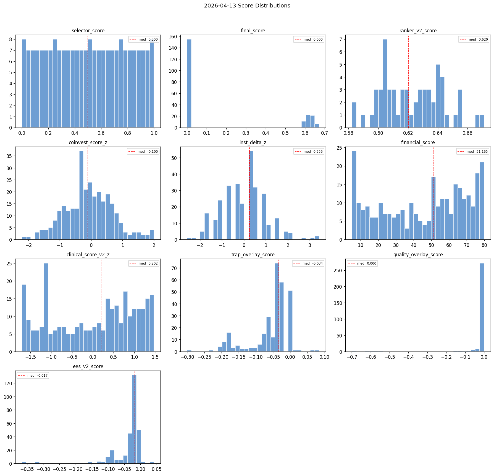
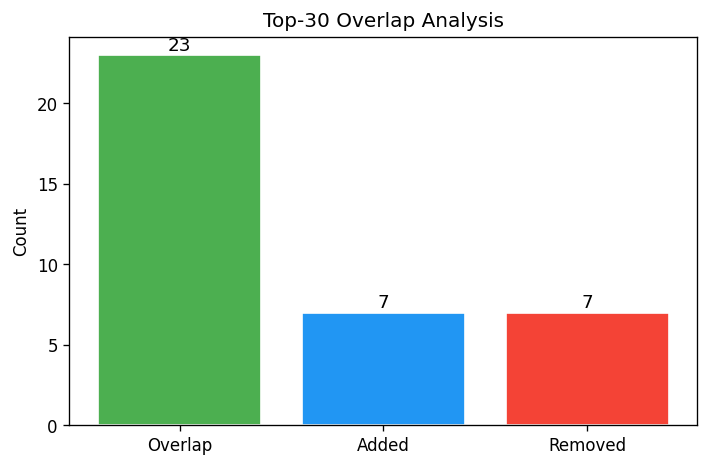
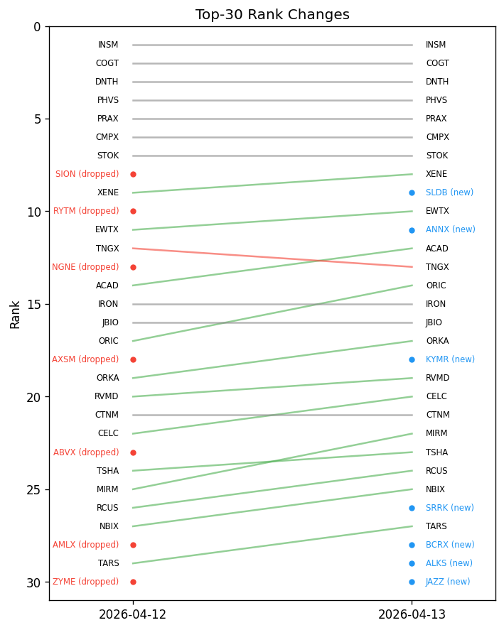

# Snapshot Summary — 2026-04-13

> **ANALYSIS ONLY** — This report is generated from production data for operator review. It does not represent trading recommendations or model changes.

**Source:** `data/snapshots/2026-04-13/rankings.csv`
**Rows:** 297 | **Columns:** 272
**Generated:** 2026-04-13 16:50 UTC

## Key Score Distributions

| Column | N | Mean | Std | Min | Median | Max |
| --- | --- | --- | --- | --- | --- | --- |
| selector_score | 215 | 0.5 | 0.2907 | 0.0 | 0.5 | 1.0 |
| final_score | 215 | 0.1737 | 0.2801 | 0.0 | 0.0 | 0.6711 |
| ranker_v2_score | 60 | 0.6225 | 0.0205 | 0.5823 | 0.6203 | 0.6711 |
| coinvest_score_z | 297 | -0.0751 | 0.7575 | -2.2099 | -0.1004 | 2.0079 |
| inst_delta_z | 297 | 0.0 | 1.0017 | -2.5957 | 0.2561 | 3.4247 |
| financial_score | 297 | 45.5559 | 24.3049 | 5.2003 | 51.1649 | 79.85 |
| clinical_score_v2_z | 297 | -0.0 | 1.0017 | -1.7063 | 0.2024 | 1.4749 |
| trap_overlay_score | 297 | -0.0553 | 0.0576 | -0.3006 | -0.0337 | 0.084 |
| quality_overlay_score | 297 | -0.0156 | 0.0797 | -0.6987 | 0.0 | -0.0 |
| ees_v2_score | 297 | -0.0355 | 0.0519 | -0.3656 | -0.0173 | 0.042 |

## Top 10 by Rank

| ticker | ranker_v2_rank | ranker_v2_score | selector_score | coinvest_score_z | financial_score |
| --- | --- | --- | --- | --- | --- |
| INSM | 1 | 0.671083 | 0.85514 | 1.8691 | 12.03732206629445198933655248 |
| COGT | 2 | 0.667646 | 0.995327 | 1.6143 | 6.374578743523967607263216142 |
| DNTH | 3 | 0.656021 | 0.785047 | 1.1282 | 5.200277777777777777777777778 |
| PHVS | 4 | 0.655227 | 0.96729 | 1.8001 | 39.30406229565917207383934409 |
| PRAX | 5 | 0.654031 | 0.962617 | 1.5544 | 29.66863148231980282681957648 |
| CMPX | 6 | 0.651732 | 1.0 | 1.8911 | 50.37500000000000000000000000 |
| STOK | 7 | 0.647073 | 0.883178 | 0.995 | 15.74292037623861978773703536 |
| XENE | 8 | 0.644441 | 0.948598 | 1.3656 | 38.68105226095266837684221115 |
| SLDB | 9 | 0.642983 | 0.911215 | 0.6187 | 5.200277777777777777777777778 |
| EWTX | 10 | 0.6422 | 0.990654 | 1.4357 | 46.29340277777777777777777778 |

## Gate Pass/Fail

- **ees_eligible:** pass=237, fail=60, unknown=-298
- **ineligible_reasons:** has_reasons=82, no_reasons=215
- **opt_liquidity_state:** liquid=105, illiquid=192

## Top Missingness

| Column | N Missing | % Missing |
| --- | --- | --- |
| de_drawdown_missing_reason | 297 | 100.0% |
| pre_event_put_call_ratio | 297 | 100.0% |
| missing_components | 297 | 100.0% |
| source_reliability_action | 297 | 100.0% |
| source_reliability_penalty | 297 | 100.0% |
| ms_volatility_3yr | 297 | 100.0% |
| ms_volatility_5yr | 297 | 100.0% |
| ms_star_rating | 297 | 100.0% |
| ms_return_ytd | 297 | 100.0% |
| ms_return_annualized_3yr | 297 | 100.0% |

## QA Checks

- [WARNING] constant_column: Column 'decision_engine_version' has only 1 unique value(s)
- [WARNING] constant_column: Column 'decision_engine_ruleset_id' has only 1 unique value(s)
- [WARNING] constant_column: Column 'inst_delta_nonzero_pct' has only 1 unique value(s)
- [WARNING] constant_column: Column 'has_coinvest_signal' has only 1 unique value(s)
- [WARNING] constant_column: Column 'has_inst_delta' has only 1 unique value(s)
- [WARNING] constant_column: Column 'has_catalyst_signal' has only 1 unique value(s)
- [WARNING] constant_column: Column 'dd_rel_margin_rescued' has only 1 unique value(s)
- [WARNING] constant_column: Column 'catalyst_type_mult' has only 1 unique value(s)
- [WARNING] constant_column: Column 'catalyst_type_tilt_applied' has only 1 unique value(s)
- [WARNING] constant_column: Column 'mom_state_tilt_mult' has only 1 unique value(s)
- [WARNING] constant_column: Column 'mom_state_tilt_applied' has only 1 unique value(s)
- [WARNING] constant_column: Column 'de_drawdown_missing_reason' has only 1 unique value(s)
- [WARNING] constant_column: Column 'de_drawdown_xbi' has only 1 unique value(s)
- [WARNING] constant_column: Column 'market_cap_bucket' has only 1 unique value(s)
- [WARNING] constant_column: Column 'returns_source' has only 1 unique value(s)

## Charts

---

# Snapshot Comparison

> **ANALYSIS ONLY** — This report is generated from production data for operator review. It does not represent trading recommendations or model changes.

**A:** `data/snapshots/2026-04-13/rankings.csv` (2026-04-13, 297 rows)
**B:** `data/snapshots/2026-04-12/rankings.csv` (2026-04-12, 297 rows)
**Generated:** 2026-04-13 16:50 UTC

## Top-N Overlap

- **N:** 30
- **Overlap:** 23 (76.7%)
- **Added:** 7 — ABVX, AMLX, AXSM, NGNE, RYTM, SION, ZYME
- **Removed:** 7 — ALKS, ANNX, BCRX, JAZZ, KYMR, SLDB, SRRK

## Schema Changes

- Common columns: 272
- Schemas are identical.

## Largest Score Drifts (top 15)

| Ticker | Score | Before | After | Delta |
| --- | --- | --- | --- | --- |
| COGT | inst_delta_z | 3.4247 | 0.0 | -3.4247 |
| CMPX | inst_delta_z | 3.4247 | 0.0 | -3.4247 |
| EWTX | inst_delta_z | 3.1078 | 0.0 | -3.1078 |
| RNA | inst_delta_z | 2.791 | 0.0 | -2.791 |
| PEPG | inst_delta_z | -2.5957 | 0.0 | 2.5957 |
| INSM | inst_delta_z | -2.2789 | 0.0 | 2.2789 |
| RCUS | inst_delta_z | 2.1572 | 0.0 | -2.1572 |
| BCRX | inst_delta_z | 2.1572 | 0.0 | -2.1572 |
| TECX | inst_delta_z | 2.1572 | 0.0 | -2.1572 |
| VRDN | inst_delta_z | 2.1572 | 0.0 | -2.1572 |
| AMLX | inst_delta_z | -1.962 | 0.0 | 1.962 |
| ARVN | inst_delta_z | -1.962 | 0.0 | 1.962 |
| IONS | inst_delta_z | -1.962 | 0.0 | 1.962 |
| LRMR | inst_delta_z | -1.962 | 0.0 | 1.962 |
| LQDA | inst_delta_z | -1.962 | 0.0 | 1.962 |
| COGT | clinical_score_v2_z | -0.3748 | -1.3288 | -0.954 |
| VRDN | clinical_score_v2_z | -0.2826 | -1.1633 | -0.8807 |
| AMLX | final_score | 0.0001 | 0.6232 | 0.6231 |
| BCRX | clinical_score_v2_z | 0.8119 | 0.2746 | -0.5373 |
| LRMR | clinical_score_v2_z | 1.2616 | 0.7669 | -0.4947 |

---

## Artifact Catalog

### CATALYST
- `catalyst_shadow_metrics.json` (1.0 KB) — Shadow comparison metrics
- `catalyst_source_mix.json` (0.6 KB) — Catalyst source distribution

### COVERAGE
- `coverage_quality.json` (2.4 KB) — Coverage quality metrics
- `eligibility_summary.json` (0.5 KB) — Eligibility gate summary

### EES
- `ees_gate_diagnostics.json` (1.1 KB) — Quality/trap gate diagnostics
- `expectation_error_overlay.json` (20.7 KB) — EES v2 scores

### EXECUTION
- `execution_stress_base.json` (2.4 KB) — Base execution stress
- `execution_stress_stress.json` (2.4 KB) — Stress execution stress

### HEALTH
- `cache_health.json` (1.1 KB) — Cache freshness health

### INTEGRITY
- `rankings.csv.sha256` (0.1 KB) — Rankings checksum
- `snapshot_manifest.json` (1.5 KB) — Snapshot manifest

### OTHER
- `coverage_quality.md` (1.5 KB) — 
- `data_collection_health.json` (3.2 KB) — 
- `data_collection_health.md` (1.3 KB) — 
- `decision_portfolio.csv` (81.8 KB) — 
- `decision_portfolio.json` (161.8 KB) — 
- `decision_ruleset.json` (6.0 KB) — 
- `eligibility_debug.json` (130.3 KB) — 
- `eligibility_summary.md` (0.4 KB) — 
- `health_exposure_metrics.json` (1.9 KB) — 
- `institutional_summary.json` (139.5 KB) — 
- `institutional_summary_delta.json` (71.0 KB) — 
- `long_call_candidates.csv` (34.1 KB) — 
- `long_call_candidates.json` (182.7 KB) — 
- `long_call_candidates.md` (49.3 KB) — 
- `metadata.json` (67.4 KB) — 
- `options_diagnostics.csv` (40.8 KB) — 
- `options_diagnostics_summary.json` (3.1 KB) — 
- `options_diagnostics_summary.md` (1.8 KB) — 
- `options_forward_log.json` (18.2 KB) — 
- `options_review_queue.csv` (10.5 KB) — 
- `options_review_queue.json` (40.7 KB) — 
- `options_review_queue.md` (3.9 KB) — 
- `phase2_health.json` (1.3 KB) — 
- `phase2_run_delta.csv` (1.2 KB) — 
- `phase2_run_delta_details.json` (4.0 KB) — 
- `phase2_run_delta_report.txt` (2.4 KB) — 
- `portfolio_positions.csv` (6.7 KB) — 
- `portfolio_positions.json` (11.5 KB) — 
- `ranker_shadow_comparison.json` (1.7 KB) — 
- `regulatory_coverage.json` (1.0 KB) — 
- `review_queue.csv` (21.2 KB) — 
- `review_queue.md` (13.1 KB) — 
- `screen_output.json` (12644.6 KB) — 
- `trapops_daily_summary.json` (7.3 KB) — 

### RANKINGS
- `rankings.csv` (611.6 KB) — Main ranked universe

