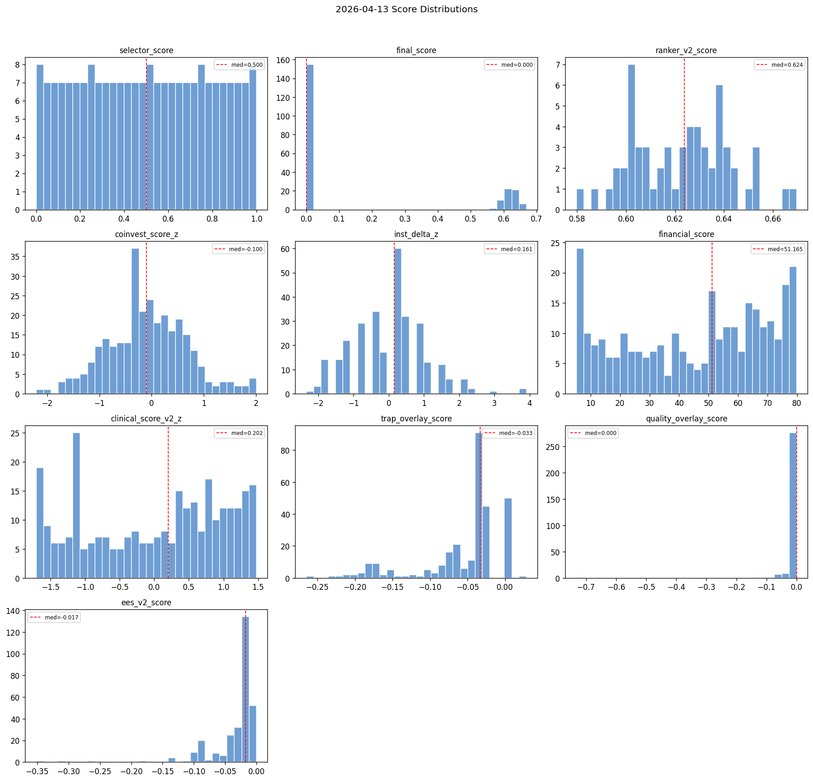
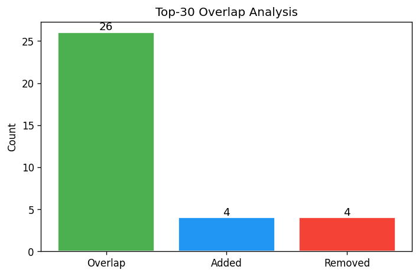
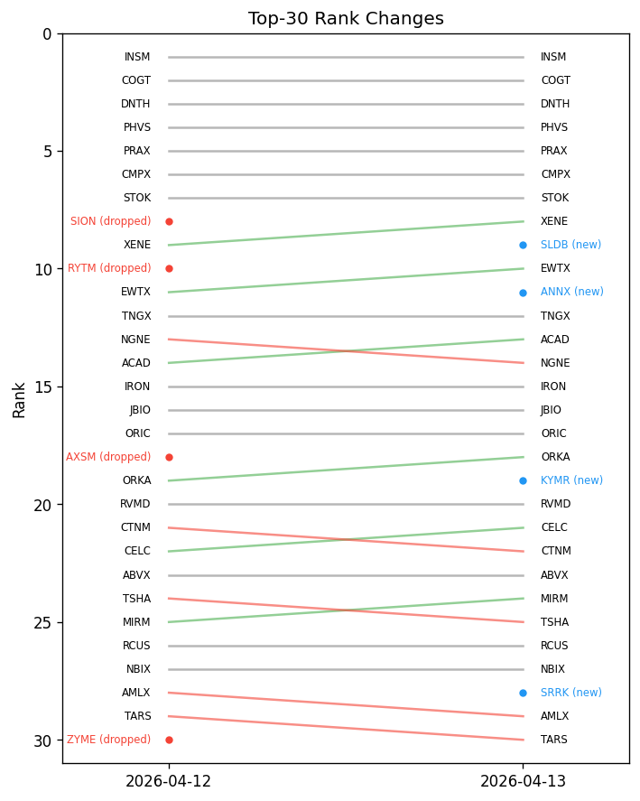

# Snapshot Summary — 2026-04-13

> **ANALYSIS ONLY** — This report is generated from production data for operator review. It does not represent trading recommendations or model changes.

**Source:** `data/snapshots/2026-04-13/rankings.csv`
**Rows:** 297 | **Columns:** 272
**Generated:** 2026-04-13 20:30 UTC

## Key Score Distributions

| Column | N | Mean | Std | Min | Median | Max |
| --- | --- | --- | --- | --- | --- | --- |
| selector_score | 215 | 0.5 | 0.2907 | 0.0 | 0.5 | 1.0 |
| final_score | 215 | 0.1738 | 0.2801 | 0.0 | 0.0 | 0.6696 |
| ranker_v2_score | 60 | 0.6225 | 0.0197 | 0.5797 | 0.6238 | 0.6696 |
| coinvest_score_z | 297 | -0.0751 | 0.7575 | -2.2099 | -0.1004 | 2.0079 |
| inst_delta_z | 297 | 0.0 | 1.0017 | -2.3387 | 0.161 | 3.9104 |
| financial_score | 297 | 45.5559 | 24.3049 | 5.2003 | 51.1649 | 79.85 |
| clinical_score_v2_z | 297 | -0.0 | 1.0017 | -1.7063 | 0.2024 | 1.4749 |
| trap_overlay_score | 297 | -0.0545 | 0.0545 | -0.2648 | -0.0333 | 0.0286 |
| quality_overlay_score | 297 | -0.0099 | 0.0573 | -0.7319 | 0.0 | -0.0 |
| ees_v2_score | 297 | -0.0322 | 0.0415 | -0.3517 | -0.0172 | -0.0 |

## Top 10 by Rank

| ticker | ranker_v2_rank | ranker_v2_score | selector_score | coinvest_score_z | financial_score |
| --- | --- | --- | --- | --- | --- |
| INSM | 1 | 0.669595 | 0.845794 | 1.8691 | 12.03732206629445198933655248 |
| COGT | 2 | 0.666046 | 0.995327 | 1.6143 | 6.374578743523967607263216142 |
| DNTH | 3 | 0.654186 | 0.827103 | 1.1282 | 5.200277777777777777777777778 |
| PHVS | 4 | 0.653664 | 0.957944 | 1.8001 | 39.30406229565917207383934409 |
| PRAX | 5 | 0.652365 | 0.976636 | 1.5544 | 29.66863148231980282681957648 |
| CMPX | 6 | 0.650197 | 1.0 | 1.8911 | 50.37500000000000000000000000 |
| STOK | 7 | 0.645155 | 0.878505 | 0.995 | 15.74292037623861978773703536 |
| XENE | 8 | 0.642668 | 0.943925 | 1.3656 | 38.68105226095266837684221115 |
| SLDB | 9 | 0.640895 | 0.901869 | 0.6187 | 5.200277777777777777777777778 |
| EWTX | 10 | 0.64045 | 0.990654 | 1.4357 | 46.29340277777777777777777778 |

## Gate Pass/Fail

- **ees_eligible:** pass=237, fail=60, unknown=-298
- **ineligible_reasons:** has_reasons=82, no_reasons=215
- **opt_liquidity_state:** liquid=105, illiquid=192

## Top Missingness

| Column | N Missing | % Missing |
| --- | --- | --- |
| de_drawdown_missing_reason | 297 | 100.0% |
| pre_event_put_call_ratio | 297 | 100.0% |
| missing_components | 297 | 100.0% |
| source_reliability_action | 297 | 100.0% |
| source_reliability_penalty | 297 | 100.0% |
| ms_volatility_3yr | 297 | 100.0% |
| ms_volatility_5yr | 297 | 100.0% |
| ms_star_rating | 297 | 100.0% |
| ms_return_ytd | 297 | 100.0% |
| ms_return_annualized_3yr | 297 | 100.0% |

## QA Checks

- [WARNING] constant_column: Column 'decision_engine_version' has only 1 unique value(s)
- [WARNING] constant_column: Column 'decision_engine_ruleset_id' has only 1 unique value(s)
- [WARNING] constant_column: Column 'inst_delta_nonzero_pct' has only 1 unique value(s)
- [WARNING] constant_column: Column 'has_coinvest_signal' has only 1 unique value(s)
- [WARNING] constant_column: Column 'has_inst_delta' has only 1 unique value(s)
- [WARNING] constant_column: Column 'has_catalyst_signal' has only 1 unique value(s)
- [WARNING] constant_column: Column 'dd_rel_margin_rescued' has only 1 unique value(s)
- [WARNING] constant_column: Column 'catalyst_type_mult' has only 1 unique value(s)
- [WARNING] constant_column: Column 'catalyst_type_tilt_applied' has only 1 unique value(s)
- [WARNING] constant_column: Column 'mom_state_tilt_mult' has only 1 unique value(s)
- [WARNING] constant_column: Column 'mom_state_tilt_applied' has only 1 unique value(s)
- [WARNING] constant_column: Column 'de_drawdown_missing_reason' has only 1 unique value(s)
- [WARNING] constant_column: Column 'de_drawdown_xbi' has only 1 unique value(s)
- [WARNING] constant_column: Column 'market_cap_bucket' has only 1 unique value(s)
- [WARNING] constant_column: Column 'returns_source' has only 1 unique value(s)

## Charts

---

# Snapshot Comparison

> **ANALYSIS ONLY** — This report is generated from production data for operator review. It does not represent trading recommendations or model changes.

**A:** `data/snapshots/2026-04-12/rankings.csv` (2026-04-12, 297 rows)
**B:** `data/snapshots/2026-04-13/rankings.csv` (2026-04-13, 297 rows)
**Generated:** 2026-04-13 20:30 UTC

## Top-N Overlap

- **N:** 30
- **Overlap:** 26 (86.7%)
- **Added:** 4 — ANNX, KYMR, SLDB, SRRK
- **Removed:** 4 — AXSM, RYTM, SION, ZYME

## Schema Changes

- Common columns: 272
- Schemas are identical.

## Largest Score Drifts (top 15)

| Ticker | Score | Before | After | Delta |
| --- | --- | --- | --- | --- |
| COGT | inst_delta_z | 0.0 | 3.9104 | 3.9104 |
| CMPX | inst_delta_z | 0.0 | 3.9104 | 3.9104 |
| EWTX | inst_delta_z | 0.0 | 2.973 | 2.973 |
| VRDN | inst_delta_z | 0.0 | 2.3481 | 2.3481 |
| RNA | inst_delta_z | 0.0 | 2.3481 | 2.3481 |
| INSM | inst_delta_z | 0.0 | -2.3387 | -2.3387 |
| RCUS | inst_delta_z | 0.0 | 2.0357 | 2.0357 |
| ORIC | inst_delta_z | 0.0 | 2.0357 | 2.0357 |
| TECX | inst_delta_z | 0.0 | 2.0357 | 2.0357 |
| BCRX | inst_delta_z | 0.0 | 2.0357 | 2.0357 |
| SLDB | inst_delta_z | 0.0 | 2.0357 | 2.0357 |
| ANNX | inst_delta_z | 0.0 | 2.0357 | 2.0357 |
| ARVN | inst_delta_z | 0.0 | -2.0262 | -2.0262 |
| IONS | inst_delta_z | 0.0 | -2.0262 | -2.0262 |
| LRMR | inst_delta_z | 0.0 | -2.0262 | -2.0262 |
| COGT | clinical_score_v2_z | -1.3288 | -0.3748 | 0.954 |
| VRDN | clinical_score_v2_z | -1.1633 | -0.2826 | 0.8807 |
| SLDB | final_score | 0.0001 | 0.6409 | 0.6408 |
| ANNX | final_score | 0.0001 | 0.6397 | 0.6397 |
| BCRX | clinical_score_v2_z | 0.2746 | 0.8119 | 0.5373 |

---

## Artifact Catalog

### CATALYST
- `catalyst_shadow_metrics.json` (1.0 KB) — Shadow comparison metrics
- `catalyst_source_mix.json` (0.6 KB) — Catalyst source distribution

### COVERAGE
- `coverage_quality.json` (2.4 KB) — Coverage quality metrics
- `eligibility_summary.json` (0.5 KB) — Eligibility gate summary

### EES
- `ees_gate_diagnostics.json` (1.1 KB) — Quality/trap gate diagnostics
- `expectation_error_overlay.json` (20.6 KB) — EES v2 scores

### EXECUTION
- `execution_stress_base.json` (2.4 KB) — Base execution stress
- `execution_stress_stress.json` (2.4 KB) — Stress execution stress

### EXPRESSION
- `expression_overlay_summary.json` (1.8 KB) — Expression overlay summary
- `expression_recommendations.json` (59.7 KB) — Tradeable recommendations

### HEALTH
- `cache_health.json` (1.1 KB) — Cache freshness health

### INTEGRITY
- `rankings.csv.sha256` (0.1 KB) — Rankings checksum
- `snapshot_manifest.json` (7.7 KB) — Snapshot manifest

### OTHER
- `coverage_quality.md` (1.5 KB) — 
- `data_collection_health.json` (3.0 KB) — 
- `data_collection_health.md` (1.2 KB) — 
- `decision_portfolio.csv` (81.8 KB) — 
- `decision_portfolio.json` (162.0 KB) — 
- `decision_ruleset.json` (6.0 KB) — 
- `eligibility_debug.json` (130.3 KB) — 
- `eligibility_summary.md` (0.4 KB) — 
- `health_exposure_metrics.json` (1.8 KB) — 
- `institutional_summary.json` (143.7 KB) — 
- `institutional_summary_delta.json` (71.0 KB) — 
- `long_call_candidates.csv` (34.4 KB) — 
- `long_call_candidates.json` (184.2 KB) — 
- `long_call_candidates.md` (50.1 KB) — 
- `metadata.json` (67.6 KB) — 
- `options_diagnostics.csv` (41.1 KB) — 
- `options_diagnostics_summary.json` (3.1 KB) — 
- `options_diagnostics_summary.md` (1.8 KB) — 
- `options_forward_log.json` (18.2 KB) — 
- `options_review_queue.csv` (10.5 KB) — 
- `options_review_queue.json` (40.7 KB) — 
- `options_review_queue.md` (4.0 KB) — 
- `phase2_health.json` (1.3 KB) — 
- `phase2_run_delta.csv` (1.2 KB) — 
- `phase2_run_delta_details.json` (4.1 KB) — 
- `phase2_run_delta_report.txt` (2.5 KB) — 
- `portfolio_positions.csv` (6.8 KB) — 
- `portfolio_positions.json` (11.5 KB) — 
- `ranker_shadow_comparison.json` (1.2 KB) — 
- `regulatory_coverage.json` (1.0 KB) — 
- `review_queue.csv` (21.4 KB) — 
- `review_queue.md` (13.2 KB) — 
- `screen_output.json` (12644.4 KB) — 
- `trapops_daily_summary.json` (7.3 KB) — 

### RANKINGS
- `rankings.csv` (612.8 KB) — Main ranked universe

