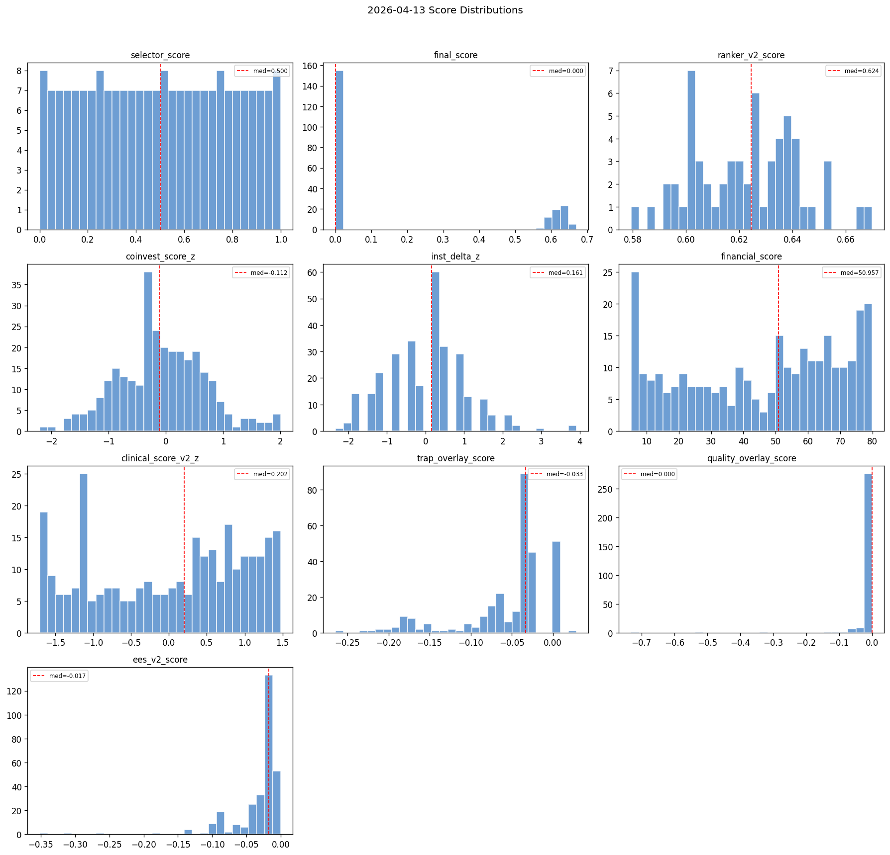
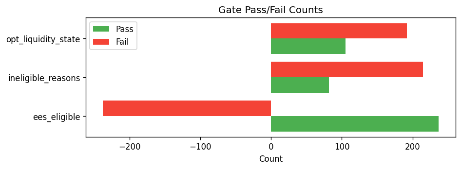
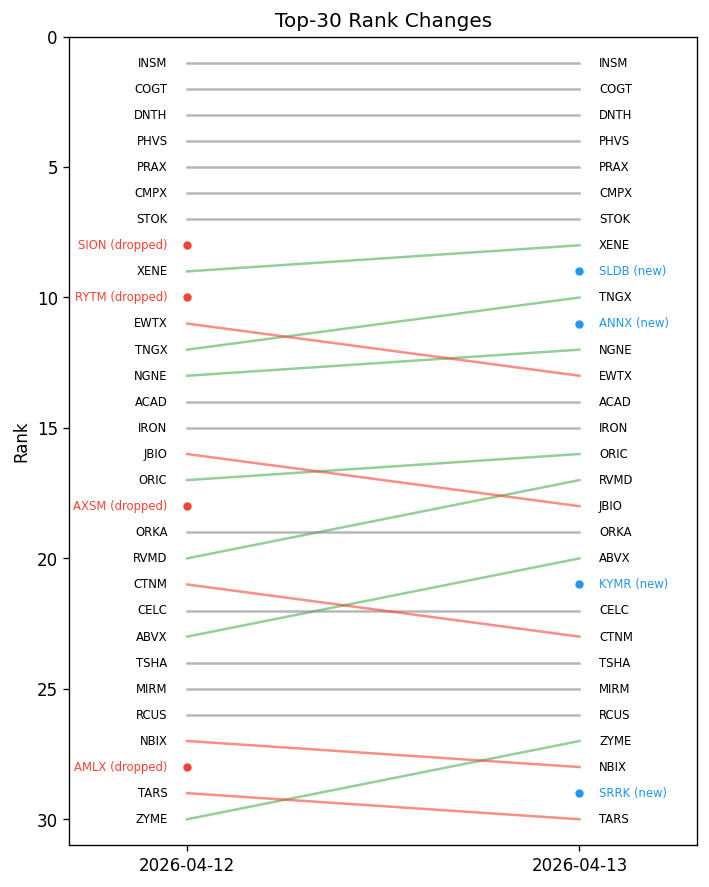

# Snapshot Summary — 2026-04-13

> **ANALYSIS ONLY** — This report is generated from production data for operator review. It does not represent trading recommendations or model changes.

**Source:** `data/snapshots/2026-04-13/rankings.csv`
**Rows:** 297 | **Columns:** 272
**Generated:** 2026-04-13 20:43 UTC

## Key Score Distributions

| Column | N | Mean | Std | Min | Median | Max |
| --- | --- | --- | --- | --- | --- | --- |
| selector_score | 215 | 0.5 | 0.2907 | 0.0 | 0.5 | 1.0 |
| final_score | 215 | 0.1738 | 0.2801 | 0.0 | 0.0 | 0.6698 |
| ranker_v2_score | 60 | 0.6225 | 0.0196 | 0.5794 | 0.6245 | 0.6698 |
| coinvest_score_z | 297 | -0.0752 | 0.7577 | -2.2046 | -0.1121 | 2.0035 |
| inst_delta_z | 297 | 0.0 | 1.0017 | -2.3387 | 0.161 | 3.9104 |
| financial_score | 297 | 45.5537 | 24.3011 | 5.2003 | 50.9574 | 79.85 |
| clinical_score_v2_z | 297 | -0.0 | 1.0017 | -1.7063 | 0.2024 | 1.4749 |
| trap_overlay_score | 297 | -0.0541 | 0.0542 | -0.2648 | -0.0333 | 0.0286 |
| quality_overlay_score | 297 | -0.0099 | 0.0572 | -0.7319 | 0.0 | -0.0 |
| ees_v2_score | 297 | -0.032 | 0.0414 | -0.3517 | -0.0172 | -0.0 |

## Top 10 by Rank

| ticker | ranker_v2_rank | ranker_v2_score | selector_score | coinvest_score_z | financial_score |
| --- | --- | --- | --- | --- | --- |
| INSM | 1 | 0.669802 | 0.850467 | 1.8783 | 12.03732206629445198933655248 |
| COGT | 2 | 0.66609 | 0.995327 | 1.6174 | 6.374578743523967607263216142 |
| DNTH | 3 | 0.654023 | 0.82243 | 1.1249 | 5.200277777777777777777777778 |
| PHVS | 4 | 0.653162 | 0.957944 | 1.7977 | 39.92984507821538152004426336 |
| PRAX | 5 | 0.652314 | 0.976636 | 1.5565 | 29.66863148231980282681957648 |
| CMPX | 6 | 0.647295 | 1.0 | 1.8995 | 56.00000000000000000000000000 |
| STOK | 7 | 0.64479 | 0.873832 | 0.9956 | 16.22906292440018107741059303 |
| XENE | 8 | 0.641509 | 0.943925 | 1.3655 | 40.55840060862129671545696896 |
| SLDB | 9 | 0.640662 | 0.901869 | 0.6147 | 5.200277777777777777777777778 |
| TNGX | 10 | 0.639943 | 0.962617 | 1.4569 | 47.97284444444444444444444444 |

## Gate Pass/Fail

- **ees_eligible:** pass=237, fail=60, unknown=-298
- **ineligible_reasons:** has_reasons=82, no_reasons=215
- **opt_liquidity_state:** liquid=105, illiquid=192

## Top Missingness

| Column | N Missing | % Missing |
| --- | --- | --- |
| de_drawdown_missing_reason | 297 | 100.0% |
| pre_event_put_call_ratio | 297 | 100.0% |
| missing_components | 297 | 100.0% |
| source_reliability_action | 297 | 100.0% |
| source_reliability_penalty | 297 | 100.0% |
| ms_volatility_3yr | 297 | 100.0% |
| ms_volatility_5yr | 297 | 100.0% |
| ms_star_rating | 297 | 100.0% |
| ms_return_ytd | 297 | 100.0% |
| ms_return_annualized_3yr | 297 | 100.0% |

## QA Checks

- [WARNING] constant_column: Column 'decision_engine_version' has only 1 unique value(s)
- [WARNING] constant_column: Column 'decision_engine_ruleset_id' has only 1 unique value(s)
- [WARNING] constant_column: Column 'inst_delta_nonzero_pct' has only 1 unique value(s)
- [WARNING] constant_column: Column 'has_coinvest_signal' has only 1 unique value(s)
- [WARNING] constant_column: Column 'has_inst_delta' has only 1 unique value(s)
- [WARNING] constant_column: Column 'has_catalyst_signal' has only 1 unique value(s)
- [WARNING] constant_column: Column 'dd_rel_margin_rescued' has only 1 unique value(s)
- [WARNING] constant_column: Column 'catalyst_type_mult' has only 1 unique value(s)
- [WARNING] constant_column: Column 'catalyst_type_tilt_applied' has only 1 unique value(s)
- [WARNING] constant_column: Column 'mom_state_tilt_mult' has only 1 unique value(s)
- [WARNING] constant_column: Column 'mom_state_tilt_applied' has only 1 unique value(s)
- [WARNING] constant_column: Column 'de_drawdown_missing_reason' has only 1 unique value(s)
- [WARNING] constant_column: Column 'de_drawdown_xbi' has only 1 unique value(s)
- [WARNING] constant_column: Column 'market_cap_bucket' has only 1 unique value(s)
- [WARNING] constant_column: Column 'returns_source' has only 1 unique value(s)

## Charts

---

# Snapshot Comparison

> **ANALYSIS ONLY** — This report is generated from production data for operator review. It does not represent trading recommendations or model changes.

**A:** `data/snapshots/2026-04-12/rankings.csv` (2026-04-12, 297 rows)
**B:** `data/snapshots/2026-04-13/rankings.csv` (2026-04-13, 297 rows)
**Generated:** 2026-04-13 20:43 UTC

## Top-N Overlap

- **N:** 30
- **Overlap:** 26 (86.7%)
- **Added:** 4 — ANNX, KYMR, SLDB, SRRK
- **Removed:** 4 — AMLX, AXSM, RYTM, SION

## Schema Changes

- Common columns: 272
- Schemas are identical.

## Largest Score Drifts (top 15)

| Ticker | Score | Before | After | Delta |
| --- | --- | --- | --- | --- |
| NRIX | financial_score | 61.625 | 5.2003 | -56.4247 |
| CLLS | financial_score | 38.3334 | 22.9735 | -15.3599 |
| RVMD | financial_score | 49.6493 | 38.0608 | -11.5885 |
| APGE | financial_score | 35.6944 | 44.1111 | 8.4167 |
| ABVX | financial_score | 32.0109 | 24.8385 | -7.1724 |
| IOVA | financial_score | 12.5272 | 18.6225 | 6.0953 |
| CLYM | financial_score | 37.7517 | 31.6736 | -6.0781 |
| TYRA | financial_score | 31.6736 | 37.7517 | 6.0781 |
| ALDX | financial_score | 62.5585 | 68.5904 | 6.0319 |
| CMPX | financial_score | 50.375 | 56.0 | 5.625 |
| KROS | financial_score | 68.75 | 63.3929 | -5.3571 |
| IVVD | financial_score | 66.2447 | 71.2713 | 5.0266 |
| VCEL | financial_score | 20.2087 | 15.7429 | -4.4658 |
| ANRO | financial_score | 60.883 | 56.8617 | -4.0213 |
| OPCH | financial_score | 23.76 | 27.7778 | 4.0178 |
| CMPX | inst_delta_z | 0.0 | 3.9104 | 3.9104 |
| IVVD | inst_delta_z | 0.0 | 1.7232 | 1.7232 |
| ANRO | inst_delta_z | 0.0 | 1.0983 | 1.0983 |
| IOVA | inst_delta_z | 0.0 | -1.0889 | -1.0889 |
| VCEL | inst_delta_z | 0.0 | -1.0889 | -1.0889 |

---

## Artifact Catalog

### CATALYST
- `catalyst_shadow_metrics.json` (1.0 KB) — Shadow comparison metrics
- `catalyst_source_mix.json` (0.6 KB) — Catalyst source distribution

### COVERAGE
- `coverage_quality.json` (2.4 KB) — Coverage quality metrics
- `eligibility_summary.json` (0.5 KB) — Eligibility gate summary

### EES
- `ees_gate_diagnostics.json` (1.1 KB) — Quality/trap gate diagnostics
- `expectation_error_overlay.json` (20.6 KB) — EES v2 scores

### EXECUTION
- `execution_stress_base.json` (2.4 KB) — Base execution stress
- `execution_stress_stress.json` (2.4 KB) — Stress execution stress

### EXPRESSION
- `expression_overlay_summary.json` (1.8 KB) — Expression overlay summary
- `expression_recommendations.json` (58.2 KB) — Tradeable recommendations

### HEALTH
- `cache_health.json` (1.2 KB) — Cache freshness health

### INTEGRITY
- `rankings.csv.sha256` (0.1 KB) — Rankings checksum
- `snapshot_manifest.json` (1.5 KB) — Snapshot manifest

### OTHER
- `ACTION.json` (27.0 KB) — 
- `ACTION.md` (4.5 KB) — 
- `_step_progress.json` (0.5 KB) — 
- `coverage_quality.md` (1.5 KB) — 
- `data_collection_health.json` (3.1 KB) — 
- `data_collection_health.md` (1.1 KB) — 
- `decision_portfolio.csv` (81.9 KB) — 
- `decision_portfolio.json` (162.0 KB) — 
- `decision_ruleset.json` (6.0 KB) — 
- `drift_report.json` (1.2 KB) — 
- `drift_report.md` (0.6 KB) — 
- `eligibility_debug.json` (130.3 KB) — 
- `eligibility_summary.md` (0.4 KB) — 
- `health_exposure_metrics.json` (1.9 KB) — 
- `inputs_manifest.json` (7.1 KB) — 
- `institutional_summary.json` (143.7 KB) — 
- `institutional_summary_delta.json` (71.0 KB) — 
- `long_call_candidates.csv` (33.6 KB) — 
- `long_call_candidates.json` (179.8 KB) — 
- `long_call_candidates.md` (48.8 KB) — 
- `metadata.json` (67.8 KB) — 
- `options_diagnostics.csv` (41.1 KB) — 
- `options_diagnostics_summary.json` (3.1 KB) — 
- `options_diagnostics_summary.md` (1.8 KB) — 
- `options_forward_log.json` (17.5 KB) — 
- `options_review_queue.csv` (8.3 KB) — 
- `options_review_queue.json` (31.4 KB) — 
- `options_review_queue.md` (3.6 KB) — 
- `phase2_health.json` (1.3 KB) — 
- `phase2_run_delta.csv` (1.0 KB) — 
- `phase2_run_delta_details.json` (2.1 KB) — 
- `phase2_run_delta_report.txt` (2.0 KB) — 
- `pnl_attribution.json` (10.4 KB) — 
- `pnl_attribution.md` (0.6 KB) — 
- `portfolio_positions.csv` (6.9 KB) — 
- `portfolio_positions.json` (11.5 KB) — 
- `ranker_shadow_comparison.json` (1.2 KB) — 
- `regulatory_coverage.json` (0.6 KB) — 
- `review_queue.csv` (21.3 KB) — 
- `review_queue.md` (13.1 KB) — 
- `ruleset_health.json` (0.4 KB) — 
- `run_manifest.json` (15.2 KB) — 
- `screen_output.json` (12652.0 KB) — 
- `surface_delta.csv` (12.1 KB) — 
- `surface_delta.json` (48.3 KB) — 
- `surface_delta.md` (8.2 KB) — 

### RANKINGS
- `rankings.csv` (613.1 KB) — Main ranked universe

