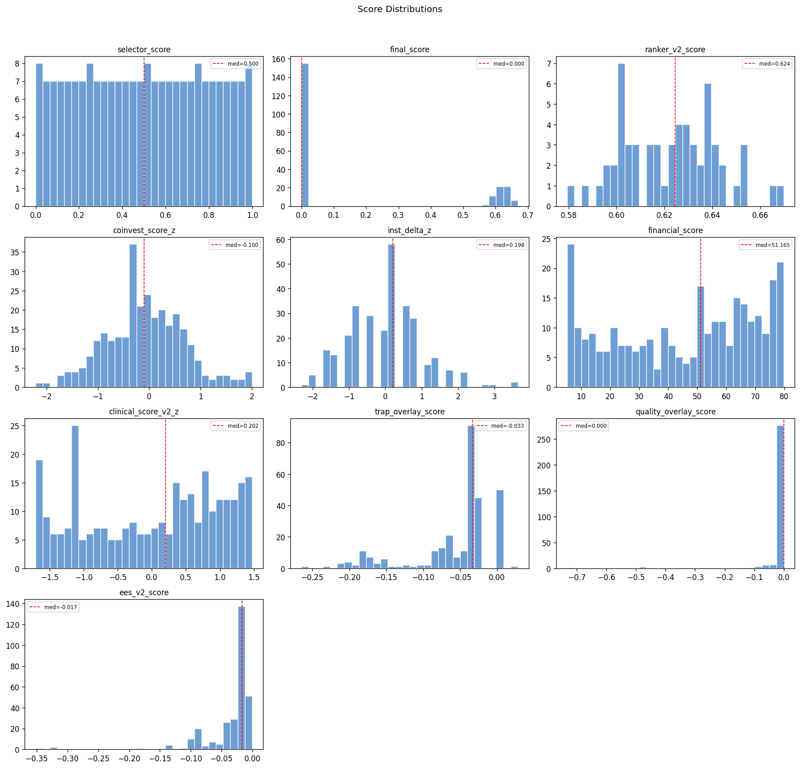

# Snapshot Summary — 2026-04-13

> **ANALYSIS ONLY** — This report is generated from production data for operator review. It does not represent trading recommendations or model changes.

**Source:** `data/snapshots/2026-04-13/rankings.csv`
**Rows:** 297 | **Columns:** 272
**Generated:** 2026-04-13 19:51 UTC

## Key Score Distributions

| Column | N | Mean | Std | Min | Median | Max |
| --- | --- | --- | --- | --- | --- | --- |
| selector_score | 215 | 0.5 | 0.2907 | 0.0 | 0.5 | 1.0 |
| final_score | 215 | 0.1738 | 0.2801 | 0.0 | 0.0 | 0.6699 |
| ranker_v2_score | 60 | 0.6225 | 0.0199 | 0.5794 | 0.6245 | 0.6699 |
| coinvest_score_z | 297 | -0.0751 | 0.7575 | -2.2099 | -0.1004 | 2.0079 |
| inst_delta_z | 297 | 0.0 | 1.0017 | -2.3091 | 0.1984 | 3.6463 |
| financial_score | 297 | 45.5559 | 24.3049 | 5.2003 | 51.1649 | 79.85 |
| clinical_score_v2_z | 297 | -0.0 | 1.0017 | -1.7063 | 0.2024 | 1.4749 |
| trap_overlay_score | 297 | -0.0551 | 0.0556 | -0.2648 | -0.0331 | 0.0286 |
| quality_overlay_score | 297 | -0.0103 | 0.0593 | -0.7321 | 0.0 | -0.0 |
| ees_v2_score | 297 | -0.0327 | 0.0431 | -0.3518 | -0.0169 | -0.0 |

## Top 10 by Rank

| ticker | ranker_v2_rank | ranker_v2_score | selector_score | coinvest_score_z | financial_score |
| --- | --- | --- | --- | --- | --- |
| INSM | 1 | 0.66988 | 0.845794 | 1.8691 | 12.03732206629445198933655248 |
| COGT | 2 | 0.666315 | 0.995327 | 1.6143 | 6.374578743523967607263216142 |
| DNTH | 3 | 0.654387 | 0.780374 | 1.1282 | 5.200277777777777777777777778 |
| PHVS | 4 | 0.653832 | 0.962617 | 1.8001 | 39.30406229565917207383934409 |
| PRAX | 5 | 0.652533 | 0.96729 | 1.5544 | 29.66863148231980282681957648 |
| CMPX | 6 | 0.650334 | 1.0 | 1.8911 | 50.37500000000000000000000000 |
| STOK | 7 | 0.645292 | 0.878505 | 0.995 | 15.74292037623861978773703536 |
| XENE | 8 | 0.64277 | 0.943925 | 1.3656 | 38.68105226095266837684221115 |
| SLDB | 9 | 0.641015 | 0.906542 | 0.6187 | 5.200277777777777777777777778 |
| EWTX | 10 | 0.640532 | 0.990654 | 1.4357 | 46.29340277777777777777777778 |

## Gate Pass/Fail

- **ees_eligible:** pass=237, fail=60, unknown=-298
- **ineligible_reasons:** has_reasons=82, no_reasons=215
- **opt_liquidity_state:** liquid=105, illiquid=192

## Top Missingness

| Column | N Missing | % Missing |
| --- | --- | --- |
| de_drawdown_missing_reason | 297 | 100.0% |
| pre_event_put_call_ratio | 297 | 100.0% |
| missing_components | 297 | 100.0% |
| source_reliability_action | 297 | 100.0% |
| source_reliability_penalty | 297 | 100.0% |
| ms_volatility_3yr | 297 | 100.0% |
| ms_volatility_5yr | 297 | 100.0% |
| ms_star_rating | 297 | 100.0% |
| ms_return_ytd | 297 | 100.0% |
| ms_return_annualized_3yr | 297 | 100.0% |

## QA Checks

- [WARNING] constant_column: Column 'decision_engine_version' has only 1 unique value(s)
- [WARNING] constant_column: Column 'decision_engine_ruleset_id' has only 1 unique value(s)
- [WARNING] constant_column: Column 'inst_delta_nonzero_pct' has only 1 unique value(s)
- [WARNING] constant_column: Column 'has_coinvest_signal' has only 1 unique value(s)
- [WARNING] constant_column: Column 'has_inst_delta' has only 1 unique value(s)
- [WARNING] constant_column: Column 'has_catalyst_signal' has only 1 unique value(s)
- [WARNING] constant_column: Column 'dd_rel_margin_rescued' has only 1 unique value(s)
- [WARNING] constant_column: Column 'catalyst_type_mult' has only 1 unique value(s)
- [WARNING] constant_column: Column 'catalyst_type_tilt_applied' has only 1 unique value(s)
- [WARNING] constant_column: Column 'mom_state_tilt_mult' has only 1 unique value(s)
- [WARNING] constant_column: Column 'mom_state_tilt_applied' has only 1 unique value(s)
- [WARNING] constant_column: Column 'de_drawdown_missing_reason' has only 1 unique value(s)
- [WARNING] constant_column: Column 'de_drawdown_xbi' has only 1 unique value(s)
- [WARNING] constant_column: Column 'market_cap_bucket' has only 1 unique value(s)
- [WARNING] constant_column: Column 'returns_source' has only 1 unique value(s)

## Charts

