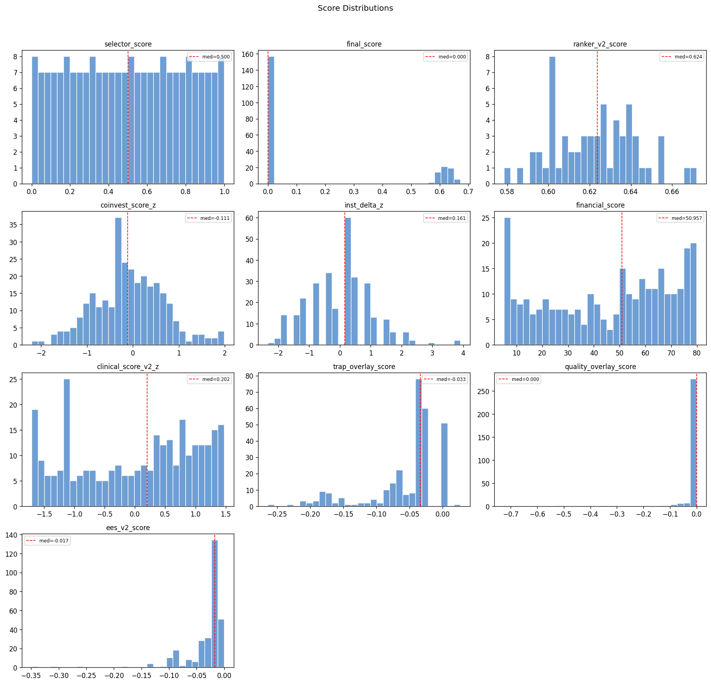
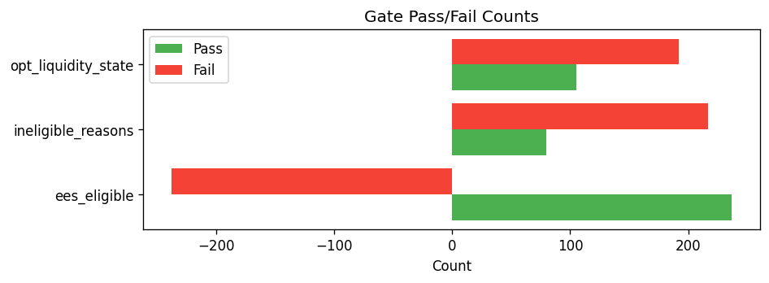

# Snapshot Summary — 2026-04-14

> **ANALYSIS ONLY** — This report is generated from production data for operator review. It does not represent trading recommendations or model changes.

**Source:** `data/snapshots/2026-04-14/rankings.csv`
**Rows:** 297 | **Columns:** 286
**Generated:** 2026-04-14 13:13 UTC

## Key Score Distributions

| Column | N | Mean | Std | Min | Median | Max |
| --- | --- | --- | --- | --- | --- | --- |
| selector_score | 217 | 0.5 | 0.2907 | 0.0 | 0.5 | 1.0 |
| final_score | 217 | 0.1721 | 0.2792 | 0.0 | 0.0 | 0.6719 |
| ranker_v2_score | 60 | 0.6225 | 0.0203 | 0.5785 | 0.6236 | 0.6719 |
| coinvest_score_z | 297 | -0.0763 | 0.7544 | -2.2046 | -0.1113 | 1.9881 |
| inst_delta_z | 297 | 0.0 | 1.0017 | -2.3387 | 0.161 | 3.9104 |
| financial_score | 297 | 45.5537 | 24.3011 | 5.2003 | 50.9574 | 79.85 |
| clinical_score_v2_z | 297 | 0.0 | 1.0017 | -1.7063 | 0.2024 | 1.475 |
| trap_overlay_score | 297 | -0.0541 | 0.0542 | -0.2639 | -0.0334 | 0.027 |
| quality_overlay_score | 297 | -0.0099 | 0.0568 | -0.7247 | 0.0 | -0.0 |
| ees_v2_score | 297 | -0.032 | 0.0413 | -0.3489 | -0.0172 | -0.0 |

## Top 10 by Rank

| ticker | ranker_v2_rank | ranker_v2_score | selector_score | coinvest_score_z | financial_score |
| --- | --- | --- | --- | --- | --- |
| INSM | 1 | 0.671893 | 0.856481 | 1.8639 | 12.03732206629445198933655248 |
| COGT | 2 | 0.667897 | 0.99537 | 1.605 | 6.374578743523967607263216142 |
| DNTH | 3 | 0.655239 | 0.810185 | 1.1163 | 5.200277777777777777777777778 |
| PHVS | 4 | 0.655041 | 0.958333 | 1.7839 | 39.92984507821538152004426336 |
| PRAX | 5 | 0.653946 | 0.976852 | 1.5446 | 29.66863148231980282681957648 |
| CMPX | 6 | 0.649229 | 1.0 | 1.885 | 56.00000000000000000000000000 |
| STOK | 7 | 0.64579 | 0.884259 | 0.988 | 16.22906292440018107741059303 |
| XENE | 8 | 0.642851 | 0.944444 | 1.355 | 40.55840060862129671545696896 |
| TNGX | 9 | 0.641363 | 0.962963 | 1.4457 | 47.97284444444444444444444444 |
| SLDB | 10 | 0.641235 | 0.898148 | 0.61 | 5.200277777777777777777777778 |

## Gate Pass/Fail

- **ees_eligible:** pass=237, fail=60, unknown=-298
- **ineligible_reasons:** has_reasons=80, no_reasons=217
- **opt_liquidity_state:** liquid=105, illiquid=192

## Top Missingness

| Column | N Missing | % Missing |
| --- | --- | --- |
| de_drawdown_missing_reason | 297 | 100.0% |
| catalyst_source_filed_at | 297 | 100.0% |
| inst_flow_abs_positive | 297 | 100.0% |
| inst_flow_abs_negative | 297 | 100.0% |
| inst_relative_underperformance | 297 | 100.0% |
| inst_relative_outperformance | 297 | 100.0% |
| pre_event_put_call_ratio | 297 | 100.0% |
| missing_components | 297 | 100.0% |
| source_reliability_action | 297 | 100.0% |
| source_reliability_penalty | 297 | 100.0% |

## QA Checks

- [WARNING] constant_column: Column 'decision_engine_version' has only 1 unique value(s)
- [WARNING] constant_column: Column 'decision_engine_ruleset_id' has only 1 unique value(s)
- [WARNING] constant_column: Column 'inst_delta_nonzero_pct' has only 1 unique value(s)
- [WARNING] constant_column: Column 'has_coinvest_signal' has only 1 unique value(s)
- [WARNING] constant_column: Column 'has_inst_delta' has only 1 unique value(s)
- [WARNING] constant_column: Column 'dd_rel_margin_rescued' has only 1 unique value(s)
- [WARNING] constant_column: Column 'catalyst_type_mult' has only 1 unique value(s)
- [WARNING] constant_column: Column 'catalyst_type_tilt_applied' has only 1 unique value(s)
- [WARNING] constant_column: Column 'mom_state_tilt_mult' has only 1 unique value(s)
- [WARNING] constant_column: Column 'mom_state_tilt_applied' has only 1 unique value(s)
- [WARNING] constant_column: Column 'de_drawdown_missing_reason' has only 1 unique value(s)
- [WARNING] constant_column: Column 'de_drawdown_xbi' has only 1 unique value(s)
- [WARNING] constant_column: Column 'market_cap_bucket' has only 1 unique value(s)
- [WARNING] constant_column: Column 'returns_source' has only 1 unique value(s)
- [WARNING] constant_column: Column 'catalyst_source_filed_at' has only 1 unique value(s)

## Charts

