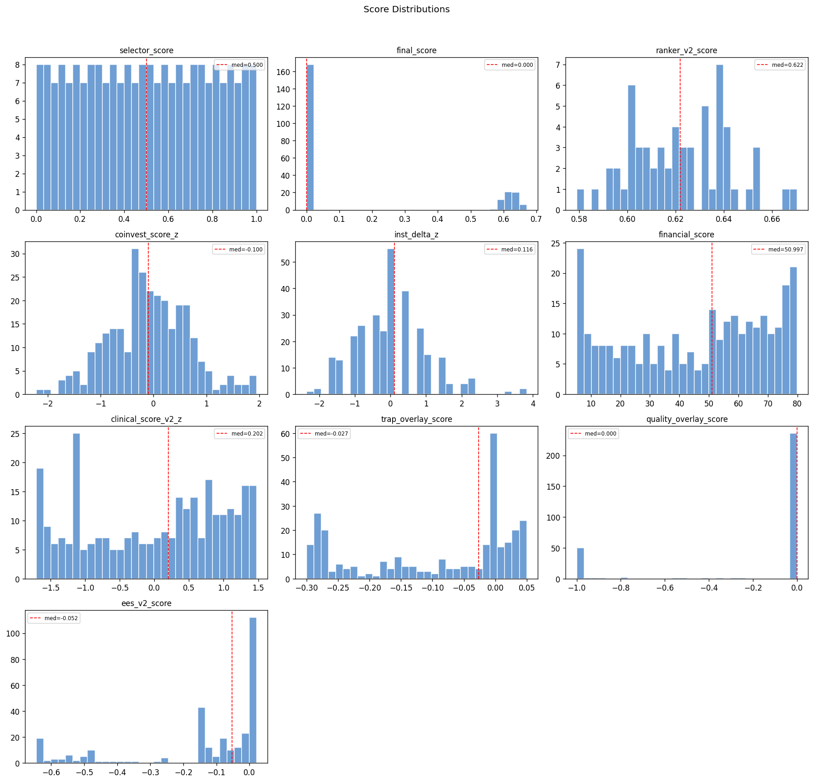
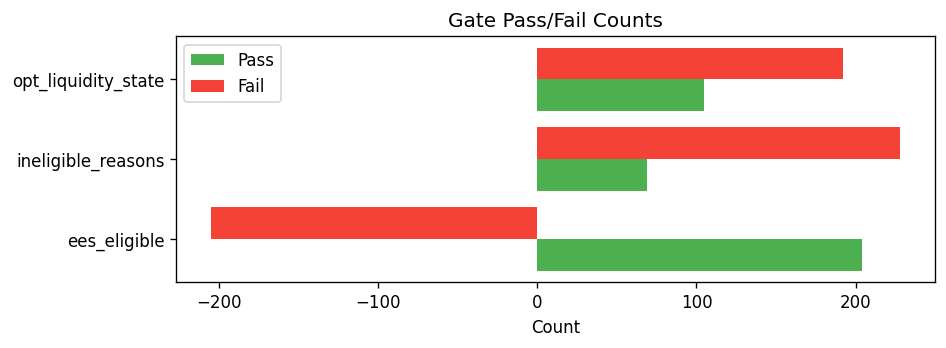

# Snapshot Summary — 2026-04-17

> **ANALYSIS ONLY** — This report is generated from production data for operator review. It does not represent trading recommendations or model changes.

**Source:** `data/snapshots/2026-04-17/rankings.csv`
**Rows:** 297 | **Columns:** 314
**Generated:** 2026-04-17 20:48 UTC

## Key Score Distributions

| Column | N | Mean | Std | Min | Median | Max |
| --- | --- | --- | --- | --- | --- | --- |
| selector_score | 228 | 0.5 | 0.2906 | 0.0 | 0.5 | 1.0 |
| final_score | 228 | 0.1638 | 0.2749 | 0.0 | 0.0 | 0.6703 |
| ranker_v2_score | 60 | 0.6225 | 0.02 | 0.579 | 0.6219 | 0.6703 |
| coinvest_score_z | 297 | -0.0796 | 0.7447 | -2.2167 | -0.0997 | 1.9457 |
| inst_delta_z | 297 | 0.0 | 1.0017 | -2.3592 | 0.1156 | 3.8278 |
| financial_score | 297 | 45.5517 | 24.3059 | 5.2003 | 50.9973 | 79.85 |
| clinical_score_v2_z | 297 | 0.0 | 1.0017 | -1.7065 | 0.2023 | 1.475 |
| trap_overlay_score | 297 | -0.0932 | 0.1227 | -0.3002 | -0.0269 | 0.0498 |
| quality_overlay_score | 297 | -0.1909 | 0.3854 | -1.0 | 0.0 | -0.0 |
| ees_v2_score | 297 | -0.1421 | 0.2092 | -0.6448 | -0.0523 | 0.021 |

## Top 10 by Rank

| ticker | ranker_v2_rank | ranker_v2_score | selector_score | coinvest_score_z | financial_score |
| --- | --- | --- | --- | --- | --- |
| INSM | 1 | 0.670317 | 0.867841 | 1.8279 | 12.52724020421507972435994165 |
| COGT | 2 | 0.666673 | 0.995595 | 1.5744 | 6.374578743523967607263216142 |
| PHVS | 3 | 0.654813 | 0.955947 | 1.7443 | 38.06081497409587042905286454 |
| DNTH | 4 | 0.654108 | 0.828194 | 1.0894 | 5.200277777777777777777777778 |
| PRAX | 5 | 0.652067 | 0.977974 | 1.5058 | 30.83424186409134349378803884 |
| CMPX | 6 | 0.650553 | 1.0 | 1.8249 | 50.37500000000000000000000000 |
| STOK | 7 | 0.645062 | 0.898678 | 0.9724 | 16.22906292440018107741059303 |
| TNGX | 8 | 0.642475 | 0.947137 | 1.3932 | 43.07471111111111111111111111 |
| XENE | 9 | 0.642347 | 0.969163 | 1.3284 | 39.92984507821538152004426336 |
| SLDB | 10 | 0.640811 | 0.889868 | 0.6083 | 5.200277777777777777777777778 |

## Gate Pass/Fail

- **ees_eligible:** pass=204, fail=93, unknown=-298
- **ineligible_reasons:** has_reasons=69, no_reasons=228
- **opt_liquidity_state:** liquid=105, illiquid=192

## Top Missingness

| Column | N Missing | % Missing |
| --- | --- | --- |
| de_drawdown_missing_reason | 297 | 100.0% |
| catalyst_source_filed_at | 297 | 100.0% |
| inst_flow_abs_positive | 297 | 100.0% |
| inst_flow_abs_negative | 297 | 100.0% |
| inst_relative_underperformance | 297 | 100.0% |
| inst_relative_outperformance | 297 | 100.0% |
| pre_event_put_call_ratio | 297 | 100.0% |
| missing_components | 297 | 100.0% |
| source_reliability_action | 297 | 100.0% |
| source_reliability_penalty | 297 | 100.0% |

## QA Checks

- [WARNING] constant_column: Column 'decision_engine_version' has only 1 unique value(s)
- [WARNING] constant_column: Column 'decision_engine_ruleset_id' has only 1 unique value(s)
- [WARNING] constant_column: Column 'inst_delta_nonzero_pct' has only 1 unique value(s)
- [WARNING] constant_column: Column 'has_coinvest_signal' has only 1 unique value(s)
- [WARNING] constant_column: Column 'has_inst_delta' has only 1 unique value(s)
- [WARNING] constant_column: Column 'dd_rel_margin_rescued' has only 1 unique value(s)
- [WARNING] constant_column: Column 'catalyst_type_mult' has only 1 unique value(s)
- [WARNING] constant_column: Column 'catalyst_type_tilt_applied' has only 1 unique value(s)
- [WARNING] constant_column: Column 'mom_state_tilt_mult' has only 1 unique value(s)
- [WARNING] constant_column: Column 'mom_state_tilt_applied' has only 1 unique value(s)
- [WARNING] constant_column: Column 'de_drawdown_missing_reason' has only 1 unique value(s)
- [WARNING] constant_column: Column 'de_drawdown_xbi' has only 1 unique value(s)
- [WARNING] constant_column: Column 'market_cap_bucket' has only 1 unique value(s)
- [WARNING] constant_column: Column 'returns_source' has only 1 unique value(s)
- [WARNING] constant_column: Column 'catalyst_source_filed_at' has only 1 unique value(s)

## Charts

