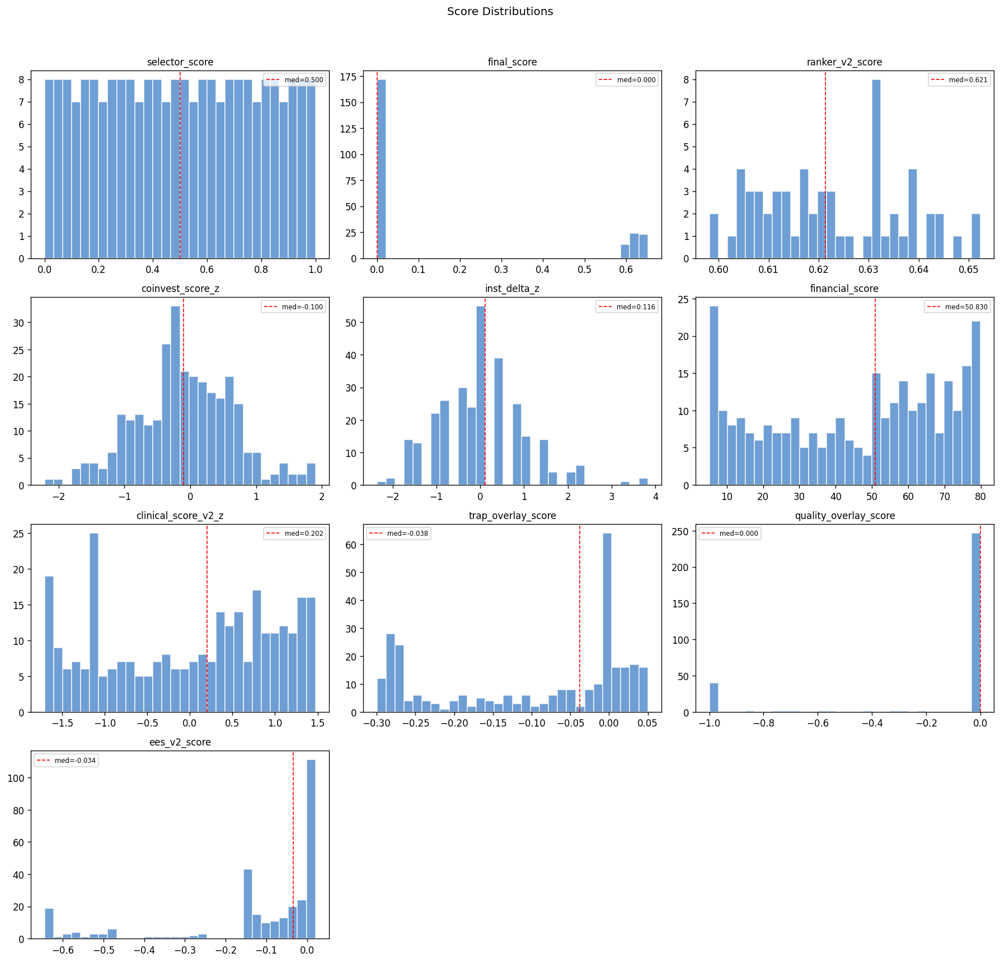
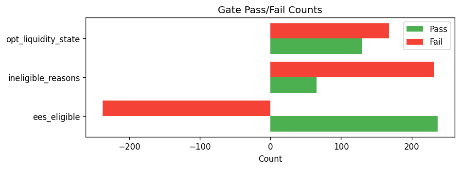

# Snapshot Summary — 2026-04-20

> **ANALYSIS ONLY** — This report is generated from production data for operator review. It does not represent trading recommendations or model changes.

**Source:** `data/snapshots/2026-04-20/rankings.csv`
**Rows:** 297 | **Columns:** 313
**Generated:** 2026-04-22 02:46 UTC

## Key Score Distributions

| Column | N | Mean | Std | Min | Median | Max |
| --- | --- | --- | --- | --- | --- | --- |
| selector_score | 232 | 0.5 | 0.2905 | 0.0 | 0.5 | 1.0 |
| final_score | 232 | 0.1611 | 0.2733 | 0.0 | 0.0 | 0.6523 |
| ranker_v2_score | 60 | 0.6227 | 0.0141 | 0.5981 | 0.6214 | 0.6523 |
| coinvest_score_z | 297 | -0.0828 | 0.7353 | -2.2138 | -0.1 | 1.9014 |
| inst_delta_z | 297 | 0.0 | 1.0017 | -2.3592 | 0.1156 | 3.8278 |
| financial_score | 297 | 45.5497 | 24.29 | 5.2003 | 50.8298 | 79.85 |
| clinical_score_v2_z | 297 | -0.0 | 1.0017 | -1.7066 | 0.2023 | 1.475 |
| trap_overlay_score | 297 | -0.0965 | 0.1227 | -0.2997 | -0.0379 | 0.0501 |
| quality_overlay_score | 297 | -0.1526 | 0.3503 | -1.0 | 0.0 | -0.0 |
| ees_v2_score | 297 | -0.1245 | 0.1959 | -0.6448 | -0.0344 | 0.0209 |

## Top 10 by Rank

| ticker | ranker_v2_rank | ranker_v2_score | selector_score | coinvest_score_z | financial_score |
| --- | --- | --- | --- | --- | --- |
| COGT | 1 | 0.652308 | 0.995671 | 1.5367 | 6.374578743523967607263216142 |
| INSM | 2 | 0.650876 | 0.87013 | 1.788 | 13.51539472360545244203007897 |
| DNTH | 3 | 0.648653 | 0.809524 | 1.068 | 5.200277777777777777777777778 |
| SLDB | 4 | 0.644291 | 0.91342 | 0.5912 | 5.200277777777777777777777778 |
| ANNX | 5 | 0.643624 | 0.904762 | 0.5598 | 5.920706327649514611941049235 |
| STOK | 6 | 0.641991 | 0.891775 | 0.9444 | 15.74292037623861978773703536 |
| ORIC | 7 | 0.641535 | 0.935065 | 0.5394 | 9.534444444444444444444444442 |
| PRAX | 8 | 0.639479 | 0.965368 | 1.4691 | 29.66863148231980282681957648 |
| KYMR | 9 | 0.638425 | 0.887446 | 0.5224 | 15.12673611111111111111111111 |
| SRRK | 10 | 0.638059 | 0.766234 | 0.0606 | 7.752832478245561088476434781 |

## Gate Pass/Fail

- **ees_eligible:** pass=237, fail=60, unknown=-298
- **ineligible_reasons:** has_reasons=65, no_reasons=232
- **opt_liquidity_state:** liquid=129, illiquid=168

## Top Missingness

| Column | N Missing | % Missing |
| --- | --- | --- |
| de_drawdown_missing_reason | 297 | 100.0% |
| catalyst_source_filed_at | 297 | 100.0% |
| inst_flow_abs_positive | 297 | 100.0% |
| inst_flow_abs_negative | 297 | 100.0% |
| inst_relative_underperformance | 297 | 100.0% |
| inst_relative_outperformance | 297 | 100.0% |
| pre_event_put_call_ratio | 297 | 100.0% |
| missing_components | 297 | 100.0% |
| source_reliability_action | 297 | 100.0% |
| source_reliability_penalty | 297 | 100.0% |

## QA Checks

- [WARNING] constant_column: Column 'decision_engine_version' has only 1 unique value(s)
- [WARNING] constant_column: Column 'decision_engine_ruleset_id' has only 1 unique value(s)
- [WARNING] constant_column: Column 'inst_delta_nonzero_pct' has only 1 unique value(s)
- [WARNING] constant_column: Column 'has_coinvest_signal' has only 1 unique value(s)
- [WARNING] constant_column: Column 'has_inst_delta' has only 1 unique value(s)
- [WARNING] constant_column: Column 'cost_bucket' has only 1 unique value(s)
- [WARNING] constant_column: Column 'cost_mult' has only 1 unique value(s)
- [WARNING] constant_column: Column 'cost_haircut_applied' has only 1 unique value(s)
- [WARNING] constant_column: Column 'dd_rel_margin_rescued' has only 1 unique value(s)
- [WARNING] constant_column: Column 'catalyst_type_mult' has only 1 unique value(s)
- [WARNING] constant_column: Column 'catalyst_type_tilt_applied' has only 1 unique value(s)
- [WARNING] constant_column: Column 'mom_state_tilt_mult' has only 1 unique value(s)
- [WARNING] constant_column: Column 'mom_state_tilt_applied' has only 1 unique value(s)
- [WARNING] constant_column: Column 'de_drawdown_missing_reason' has only 1 unique value(s)
- [WARNING] constant_column: Column 'de_drawdown_xbi' has only 1 unique value(s)

## Charts

