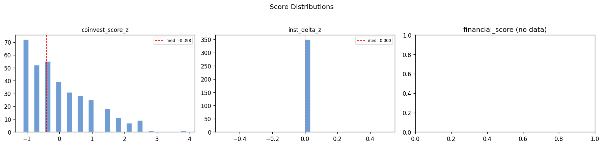
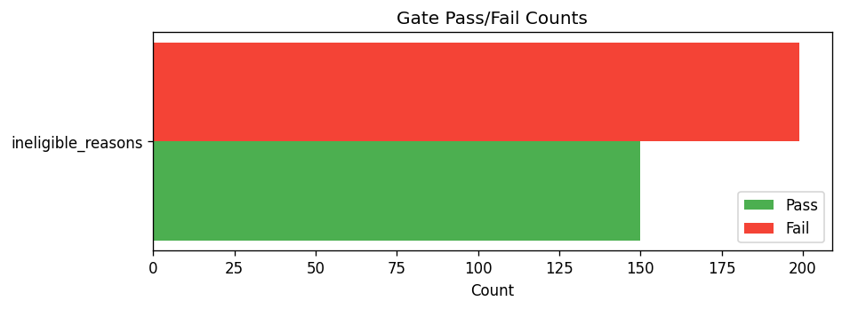

# Snapshot Summary — 2026-03-18

> **ANALYSIS ONLY** — This report is generated from production data for operator review. It does not represent trading recommendations or model changes.

**Source:** `data/snapshots_pit/2026-03-18/rankings.csv`
**Rows:** 349 | **Columns:** 111
**Generated:** 2026-05-29 15:55 UTC

## Key Score Distributions

| Column | N | Mean | Std | Min | Median | Max |
| --- | --- | --- | --- | --- | --- | --- |
| coinvest_score_z | 349 | -0.0 | 1.0014 | -1.1145 | -0.3975 | 3.9042 |
| inst_delta_z | 349 | 0.0 | 0.0 | 0 | 0.0 | 0 |

## Top 10 by Rank

(no ranked data)

## Gate Pass/Fail

- **ineligible_reasons:** has_reasons=150, no_reasons=199

## Top Missingness

| Column | N Missing | % Missing |
| --- | --- | --- |
| target_weight_pct | 349 | 100.0% |
| commercial_quality_pct | 349 | 100.0% |
| has_commercial_quality | 349 | 100.0% |
| cat_priority | 349 | 100.0% |
| top_3_drivers | 349 | 100.0% |
| catalyst_reason_detail | 349 | 100.0% |
| commercial_quality | 349 | 100.0% |
| coinvest_tag | 349 | 100.0% |
| cost_bucket | 349 | 100.0% |
| est_cost_bps | 349 | 100.0% |

## QA Checks

- [ERROR] missing_key_column: Column 'selector_score' not found
- [ERROR] missing_key_column: Column 'final_score' not found
- [WARNING] constant_column: Column 'target_weight_pct' has only 1 unique value(s)
- [WARNING] constant_column: Column 'commercial_quality_pct' has only 1 unique value(s)
- [WARNING] constant_column: Column 'has_commercial_quality' has only 1 unique value(s)
- [WARNING] constant_column: Column 'cat_priority' has only 1 unique value(s)
- [WARNING] constant_column: Column 'top_3_drivers' has only 1 unique value(s)
- [WARNING] constant_column: Column 'catalyst_reason_detail' has only 1 unique value(s)
- [WARNING] constant_column: Column 'decision_engine_version' has only 1 unique value(s)
- [WARNING] constant_column: Column 'decision_engine_ruleset_id' has only 1 unique value(s)
- [WARNING] constant_column: Column 'commercial_quality' has only 1 unique value(s)
- [WARNING] constant_column: Column 'coinvest_tag' has only 1 unique value(s)
- [WARNING] constant_column: Column 'inst_delta_z' has only 1 unique value(s)
- [WARNING] constant_column: Column 'inst_delta_net' has only 1 unique value(s)
- [WARNING] constant_column: Column 'inst_delta_new' has only 1 unique value(s)

## Charts

